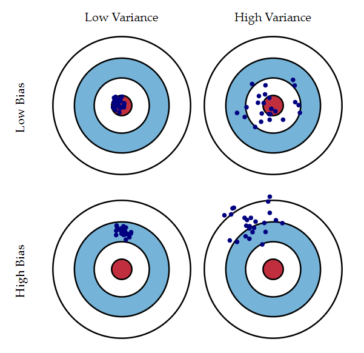
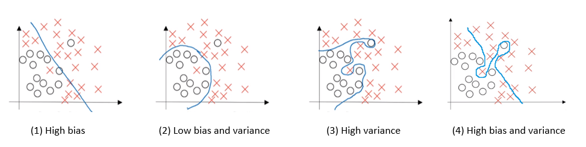

### Contents
- [**Introduction**](#introduction)
- [**What is Bias and Variance?**](#challenge-description)
- [**A real life example of bias/variance**](#first-look)
- [**Diagnose a model for bias and variance**](#goal-assumptions)
- [**Bias-variance tradeoff in  Machine Learning**](#bug-hunting)
- [**Scenario of bias-variance tradeoff in Deep Learning**](#introduction-to-css-injection)
- [**Key takeaways**](#introduction-to-content-security-policy)
- [**Further reading**](#crafting-exploitaion-strategy)

### Introduction
Bias Vs variance is considered a very basic concept in data science and is easy to understand but tough to keep track in implementations. Bias and variance are like two pans of a weighing balance, you can adjust one at the cost of other. Clear understanding of this concept is crucial for diagnosis of models.
In this blog, I am going to explain all nuances of bias, variance and their tradeoff vis-à-vis Machine learning and Deep learning.

### What is Bias and Variance?
Bias is the measure of how much a model’s predictions differ from the actual values while variance is the measure of the change in a model’s predictions for different training data.

Consider the figure shown above (taken from [Understanding the Bias-Variance Tradeoff](http://scott.fortmann-roe.com/docs/BiasVariance.html)), the center of bull’s eye represents the actual outcomes (to be predicted). Every single blue dot represents the cumulative predictions of the model for a set of training data (which changes for every dot). The four combinations of bias and variance could be:

1.	**Low bias and low variance:** The predictions are not only close to actual values (low bias) but also the predictions don’t differ much in iterations when the training data is changed (low variance), so all dots are gathered around the center close to each other. This is the most desired state.

2.	**Low bias and high variance:** The predictions are close to actual values (low bias) but differ greatly in iterations of training with varied data (high variance), so all dots are close to center but far from each other.

3.	**High bias and low variance:** The predictions are far from actual values (high bias) but don’t differ in iterations of training with varied data (low variance), so all dots are far from center but are close to each other.

4.	**High bias and high variance:** The predictions are not only far from actual values (high bias) but also far from each other (high variance), so all dots are far from center as well as each other. This is the worst of both worlds.

### A Real Life Example of Bias-Variance
Let’s understand this with a simple example. Consider that you are getting married and lot of guests are invited (more than a 1000, yeah, an Indian wedding). And because you want to give your guests best dining experience you decide to analyze their food preferences: Vegetarian/Non- vegetarian. 

You collect data of 50 guests (these are your close friends). The distribution you got is:

| Vegetarian | Non Vegetarian | Non Respondent | Total | 
| ---------- |:--------------:| --------------:| -----:|
| 18         | 25             | 7              |   50  |
 
Now you make a machine learning model based on different characteristics of these 50 friends of yours and their preference. These characteristics may include gender, age (most of them are quite young), living region (nearby you), religion and so on. 
This model is suffering from both high variance and high bias. This is how:

**High bias:** By just selecting your friends, you limit model’s understanding to only a certain class of people (young, nearby living, because they are your friends) and so the predictions on new data will be very wrong thereby increasing bias. 

**High variance:** Small sample size (just 50) is the major source of high variance. If the sample size is increased, then the result would be more consistent. In the bulls- eye diagram, the scatter would clump together if sample size is increased.

### Diagnose a Model for Bias and Variance
To diagnose a model for bias and variance, we need to understand its relationship with underfitting and overfitting of the model.

**Underfitting:** The model’s performance is poor i.e. predicted values are far from actual values which implies high bias.

**Overfitting:** The complexity of model has increased to a level that the model is tightly coupled with the training data itself and is not general enough which implies high variance.

To identify bias and variance in a model, a most popular technique used in both academia and industry is cross validating a model. In cross validation a small part of the train data set is separated out as cross validation set and the trained model is then tested on this cross-validation set.

Consider the diagram above (taken from [Andrew Ng's Deep Learning Course](https://www.coursera.org/specializations/deep-learning)). There are two classes in the data set (represented by O and `X`). The blue curve is the trained model’s curve of predictions on the train dataset.

| Binary Classification Problem | High Bias | Low Bias and Variance (Best) | High Variance | High Bias and Variance (Worst) | 
|:-----------------------------:|:---------:|:----------------------------:|:-------------:|:------------------------------:|
| Training Error                | 15%       | 1%                           |  1%           |     15%                        |
| Cross Validation Error        |  18%      |     3%                       |   12%         |      25%                       |

This error table shown above can be made for a model for identification of bias and variance in that model.
 
### Bias-Variance Tradeoff in Machine Learning
If one component (out of bias and variance) decreases, the other increases with the complexity of model. But the best model is one having least of both. So here comes the dilemma now, which one to decrease? That’s when the concept of tradeoff between bias and variance comes in picture. 

Now this hugely depends on the scenario and the use case the model is being made for. Generally, machine learning practitioners tend to give more priority to bias as compared to variance because having a lower bias means better predictions. This doesn’t mean that they don’t care about variance at all, variance is also tamed down to a certain limit so that overfitting is limited.

### Scenario of Bias-Variance Tradeoff in Deep Learning
The meaning of bias and variance remains same for deep learning as well. The big difference is that there is no tradeoff required in Deep Learning. You can reduce both bias and variance :) (of course up to a certain limit).

The ability to control both bias and variance has added to the popularity and effectiveness of deep learning.

Bias can be lowered by:
- Training a bigger neural network.
- Training the network for more epochs.
- Choosing a different network.

Variance can be lowered by:
- Getting more data for training (also using augmentation).
- Using regularization methods (dropout, L1, L2).

First, we need to identify bias and/or variance problem in the deep learning model and take actions as mentioned above. If both bias and variance are high, then iteratively reduce bias and variance till the optimized state is reached.

In this Deep Learning era, controlling bias and variance both is possible to achieve highest accuracy. Deep Learning models tend to have lower bias inherently because of high complexity and there are ways to reduce variance. Regularization methods like dropout has shown very significant improvement in variance control. May be that’s why there has been a steep turn towards deep learning. 

### Key Takeaways
- Taking care of bias and variance in a model is very important as excess of any of these two leads to poor quality models.
- Bias and variance is tightly coupled with underfitting and overfitting respectively, and this fact also helps us to diagnose bias and variance in the model by checking model’s performance over training and cross validation data set.
- There are ways to decrease both bias and variance in deep learning models using proper training and regularization.

### Further Reading
- [Understanding the Bias-Variance Tradeoff](http://scott.fortmann-roe.com/docs/BiasVariance.html)
- [Model Tuning and Bias-Variance Tradeoff](http://www.r2d3.us/visual-intro-to-machine-learning-part-2/)
- [Bias-Variance Tradeoff](https://en.wikipedia.org/wiki/Bias%E2%80%93variance_tradeoff)
